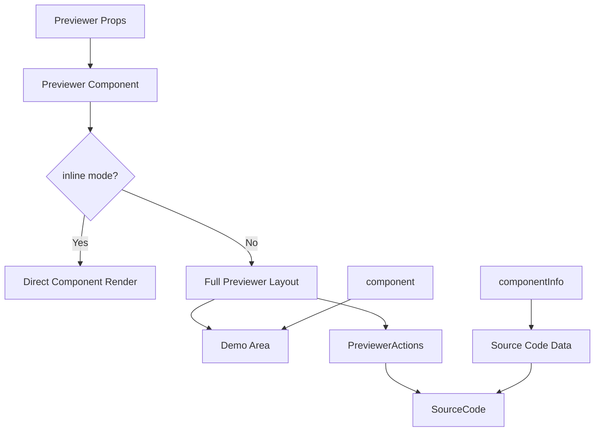

# 设计文档

## 概述

为 docusaurus-lib-dev 库设计并实现一个 Previewer 组件，该组件将借鉴现有 website/src/components 下的 Previewer、PreviewerActions 和 SourceCode 组件的设计模式，提供代码预览和展示功能。组件将支持内联模式和完整预览模式，具备代码展示、复制等交互功能。

## 架构

### 组件层次结构

```
packages/docusaurus-lib-dev/src/components/Previewer/
├── index.tsx                    # 主入口组件
├── index.less                   # 统一样式文件
└── components/                  # 子组件目录
    ├── PreviewerActions.tsx     # 操作按钮组件
    └── SourceCode.tsx           # 源码展示组件
```

### 数据流



## 组件和接口

### 主组件接口

```typescript
interface PreviewerProps {
  /** 要预览的 React 组件 */
  component: React.ComponentType<any>;
  /** 组件相关信息 */
  componentInfo: ComponentInfo;
  /** 是否为内联模式，仅渲染组件本身 */
  inline?: boolean;
  /** 自定义样式类名 */
  className?: string;
  /** 自定义样式 */
  style?: React.CSSProperties;
  /** 预览区域背景色 */
  background?: string;
  /** 标题 */
  title?: string;
  /** 描述信息 */
  description?: string;
}

interface ComponentInfo {
  /** 组件唯一标识 */
  id: string;
  /** 源代码字符串 */
  sourceCode: string;
  /** 依赖文件信息 */
  dependencies?: DependencyInfo[];
  /** 是否为内联模式 */
  inline?: boolean;
}

interface DependencyInfo {
  /** 依赖类型 */
  type: 'FILE' | 'NPM';
  /** 文件路径或包名 */
  resolvedSource: string;
  /** 文件扩展名 */
  ext: string;
  /** 文件内容 */
  value: string;
}
```

### PreviewerActions 组件

```typescript
interface PreviewerActionsProps {
  /** 组件ID */
  id: string;
  /** 依赖文件列表 */
  dependencies?: DependencyInfo[];
  /** 是否强制显示代码 */
  forceShowCode?: boolean;
  /** 默认是否显示代码 */
  defaultShowCode?: boolean;
}
```

### SourceCode 组件

```typescript
interface SourceCodeProps {
  /** 代码内容 */
  children: string;
  /** 语言类型 */
  lang: string;
  /** 高亮行号 */
  highlightLines?: number[];
  /** 额外内容 */
  extra?: React.ReactNode;
  /** 标题 */
  title?: string;
}
```

## 数据模型

### 组件状态管理

```typescript
// Previewer 组件内部状态
interface PreviewerState {
  /** 是否显示源码 */
  showCode: boolean;
  /** 当前激活的文件标签 */
  activeFileIndex: number;
  /** 组件渲染错误状态 */
  hasError: boolean;
  /** 错误信息 */
  error?: Error;
}

// SourceCode 组件状态
interface SourceCodeState {
  /** 是否已复制 */
  isCopied: boolean;
  /** 处理后的代码文本 */
  processedText: string;
}
```

## 错误处理

### 错误边界处理

1. **组件渲染错误**
   - 使用 React Error Boundary 捕获组件渲染错误
   - 显示友好的错误信息而不是白屏
   - 提供重试机制

2. **代码解析错误**
   - 验证传入的 sourceCode 格式
   - 处理无效的依赖信息
   - 提供默认的错误状态展示

3. **复制功能错误**
   - 检测浏览器是否支持 clipboard API
   - 提供降级方案（选中文本提示）

### 错误状态展示

```typescript
interface ErrorDisplayProps {
  error: Error;
  onRetry?: () => void;
  showRetry?: boolean;
}
```

## 测试策略

### 单元测试

1. **组件渲染测试**
   - 测试 inline 模式和完整模式的渲染
   - 测试不同 props 组合的渲染结果
   - 测试错误状态的处理

2. **交互功能测试**
   - 测试代码展开/收起功能
   - 测试代码复制功能
   - 测试文件标签切换功能

3. **边界情况测试**
   - 测试空数据的处理
   - 测试无效数据的处理
   - 测试组件渲染错误的处理
