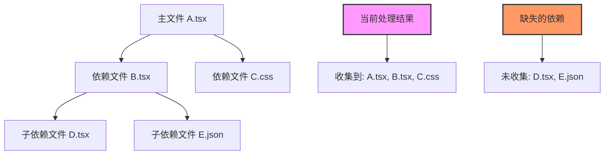
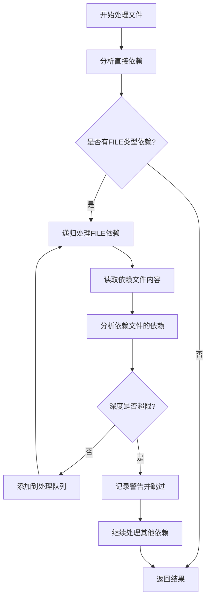
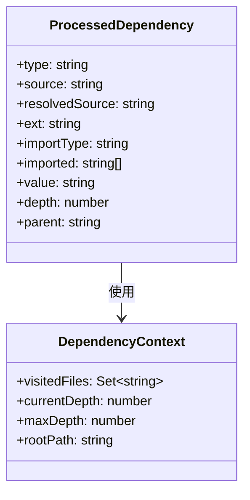
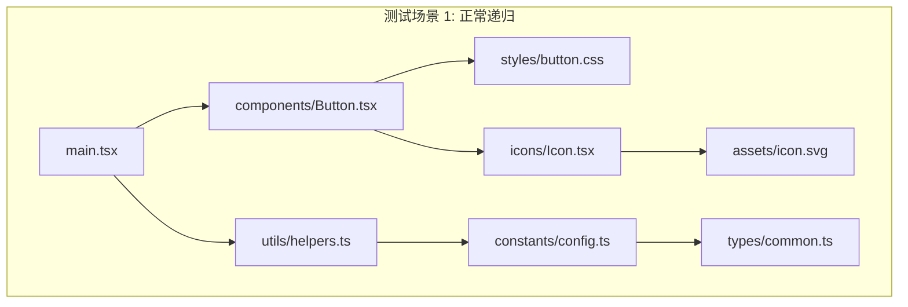

# 文件依赖收集修复设计

## 概述

当前 `FileHandler.processDependenciesParallel` 方法存在一个递归依赖收集的缺陷：当处理 FILE 类型的依赖时，该方法只会读取直接依赖的文件内容，但不会进一步分析这些依赖文件中包含的其他 FILE 类型依赖。这导致间接依赖丢失，影响整个依赖图的完整性。

## 技术栈与依赖

该修复涉及以下核心模块：
- **DependencyAnalyzer**: 负责解析文件中的 import/export 语句
- **FileHandler**: 负责文件处理和依赖收集
- **PathResolver**: 负责路径解析和规范化
- **测试框架**: Jest 单元测试

## 问题分析

### 当前实现的局限性

当前的 `processDependenciesParallel` 方法采用浅层处理策略：

### 影响范围

1. **依赖图不完整**: 间接依赖缺失导致组件渲染可能失败
2. **缓存失效**: 依赖变更无法正确触发缓存更新
3. **开发体验**: 开发者修改深层依赖文件时，预览器无法正确更新

## 架构设计

### 递归依赖收集策略

采用深度优先搜索（DFS）算法实现递归依赖收集：

### 核心组件修改

#### 1. FileHandler 增强

新增递归处理能力，支持深度控制和循环依赖检测：

| 功能特性 | 实现策略 | 目标效果 |
|---------|----------|----------|
| 递归深度控制 | 设置最大递归深度限制 | 防止过深递归导致性能问题 |
| 循环依赖检测 | 维护已访问文件集合 | 避免无限递归 |
| 错误容错 | 单个文件处理失败不影响整体 | 提高系统稳定性 |
| 性能优化 | 并行处理同级依赖 | 保持处理效率 |

#### 2. 依赖关系数据结构

### 算法流程设计

#### 递归依赖收集算法

1. **初始化阶段**
   - 创建已访问文件集合
   - 设置递归深度限制
   - 初始化依赖收集队列

2. **递归处理阶段**
   - 对每个 FILE 类型依赖进行深度分析
   - 检查循环依赖和深度限制
   - 并行处理同级依赖以提升性能

3. **结果合并阶段**
   - 去重处理（基于文件路径）
   - 按依赖层次排序
   - 生成最终依赖图

#### 性能优化策略

| 优化点 | 策略 | 预期效果 |
|-------|------|----------|
| 并行处理 | 同级依赖并行分析 | 减少总处理时间 |
| 缓存机制 | 文件级别依赖缓存 | 避免重复解析 |
| 早期退出 | 检测到循环依赖立即退出 | 防止无限递归 |
| 批量读取 | 批量读取文件内容 | 减少 I/O 操作 |

## 测试策略

### 单元测试设计

#### 基础功能测试
- 递归依赖收集正确性验证
- 循环依赖检测和处理
- 深度限制功能验证
- 错误容错机制测试

#### 复杂场景测试
设计多层依赖结构进行集成测试：

#### 边界条件测试

| 测试场景 | 输入条件 | 预期行为 |
|---------|----------|----------|
| 循环依赖 | A→B→C→A | 检测到循环并终止 |
| 深度超限 | 超过最大递归深度 | 记录警告并跳过 |
| 文件不存在 | 依赖文件缺失 | 记录错误并继续 |
| 解析失败 | 文件语法错误 | 跳过该文件继续处理 |

### 测试用例示例

创建具有以下结构的测试场景：
- **简单递归**: A → B → C（3层依赖）
- **复杂递归**: A → [B,C] → [D,E,F] → [G,H]（多分支）
- **循环依赖**: A → B → C → A（循环检测）
- **混合类型**: FILE 和 NPM 依赖混合

## 配置参数

### 新增配置选项

| 参数名 | 类型 | 默认值 | 说明 |
|-------|------|--------|------|
| maxRecursionDepth | number | 10 | 最大递归深度限制 |
| enableCircularDetection | boolean | true | 是否启用循环依赖检测 |
| allowPartialFailure | boolean | true | 是否允许部分文件处理失败 |
| parallelProcessing | boolean | true | 是否启用并行处理 |

### 向后兼容性

保持现有 API 接口不变，通过可选参数扩展功能：
- 现有调用方式完全兼容
- 新功能通过配置选项控制
- 默认行为保持原有逻辑的安全增强版本
