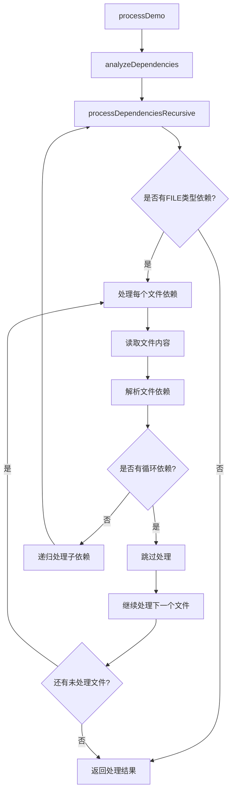
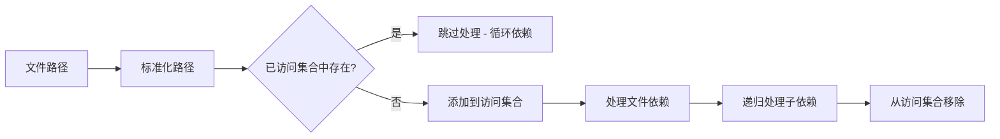
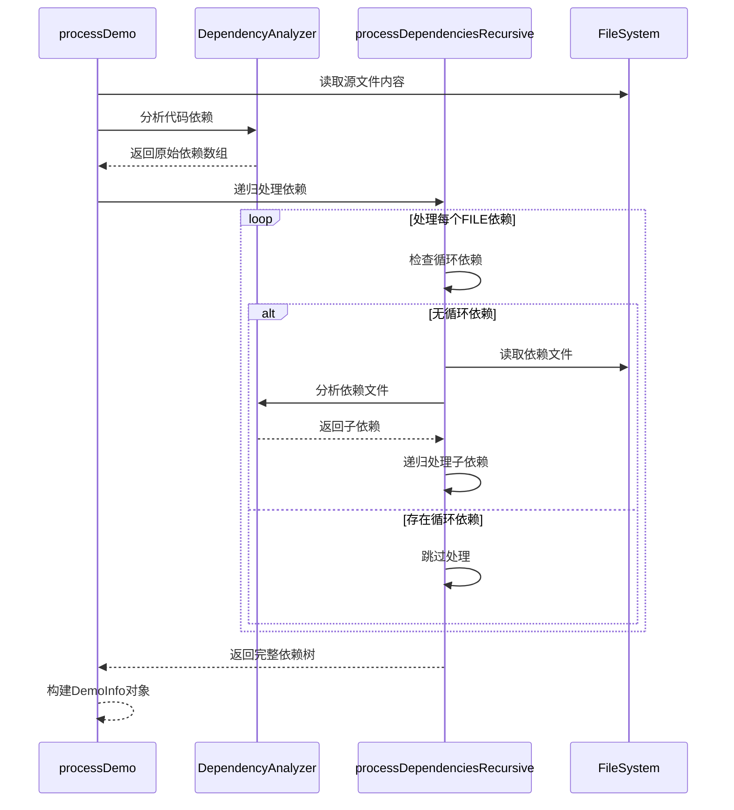

# 文件处理器递归依赖方法重构设计

## 概览

本设计文档详细描述了对 `FileHandler` 类中 `processDependenciesRecursive` 方法及相关方法的重构。重构的核心目标是简化复杂的递归依赖处理逻辑，移除不必要的配置选项，专注于核心功能：递归收集本地文件依赖直到没有更多依赖为止。

## 技术栈与依赖

- **语言**: TypeScript
- **运行环境**: Node.js >=18.0.0  
- **核心依赖**: 
  - `@babel/parser`: 用于解析 JavaScript/TypeScript 代码
  - `@babel/traverse`: 用于遍历 AST
  - `fs`: 文件系统操作
  - `path`: 路径处理

## 架构

### 当前架构问题分析

当前的递归依赖处理架构存在以下复杂性问题：

| 问题类别 | 具体问题 | 影响 |
|---------|---------|------|
| **配置复杂性** | RecursionOptions 包含多个可选配置项 | 增加了理解和维护成本 |
| **处理流程复杂** | 需要处理并行/串行、失败容错、深度限制等多种情况 | 代码逻辑复杂，难以调试 |
| **上下文管理** | DependencyContext 承载过多职责 | 状态管理复杂，容易出错 |
| **方法职责模糊** | 多个私有方法功能重叠 | 代码重复，维护困难 |

### 目标架构设计

重构后的架构将采用简化的递归模型：



## 核心组件重构

### FileHandler 类简化

#### 构造函数修改

移除 `recursionOptions` 参数及相关的默认配置逻辑：

| 修改项 | 变更说明 |
|-------|---------|
| **构造函数参数** | 移除 `recursionOptions: RecursionOptions = {}` |
| **属性移除** | 删除 `private readonly recursionOptions: Required<RecursionOptions>` |
| **依赖保留** | 保留 `pathResolver` 和 `dependencyAnalyzer` 依赖注入 |

#### processDemo 方法调整

简化方法签名，移除可选的递归配置参数：

| 当前签名 | 重构后签名 |
|---------|-----------|
| `processDemo(srcPath: string, options?: RecursionOptions): DemoInfo` | `processDemo(srcPath: string): DemoInfo` |

### 递归处理逻辑重构

#### processDependenciesRecursive 方法简化

**方法签名变更：**
- 移除 `customOptions?: RecursionOptions` 参数
- 简化为 `processDependenciesRecursive(rawDependencies: Dependency[], srcPath: string): Dependency[]`

**核心处理流程：**

1. **初始化阶段**
   - 创建已访问文件集合 `visitedFiles: Set<string>`
   - 添加根文件路径到访问集合

2. **依赖分类处理**
   - 分离 FILE 类型和 NPM 类型依赖
   - NPM 依赖直接返回，添加深度和父文件信息
   
3. **文件依赖递归处理**
   - 顺序处理每个 FILE 类型依赖
   - 对每个文件执行循环依赖检测
   - 递归分析文件内容的子依赖

#### 循环依赖检测策略

采用简单有效的访问路径跟踪机制：



### 方法移除清单

以下方法将在重构中被移除或合并：

| 方法名 | 移除原因 | 替代方案 |
|-------|---------|---------|
| `processDependenciesWithContext` | 上下文管理过于复杂 | 直接在主方法中处理 |
| `processFileDependency` | 功能可集成到主流程 | 内联到递归方法中 |
| `flattenDependencies` | 不再需要嵌套结构处理 | 使用简单的数组操作 |
| `processDependenciesParallel` | 移除并行处理需求 | 顺序处理即可满足需求 |

## 数据流设计

### 依赖处理数据流



### 依赖对象结构

每个处理后的依赖对象包含以下核心信息：

| 字段名 | 类型 | 描述 | 示例值 |
|-------|------|------|--------|
| `type` | `'NPM' \| 'FILE'` | 依赖类型 | `'FILE'` |
| `source` | `string` | 原始导入路径 | `'./components/Button'` |
| `resolvedSource` | `string` | 解析后的完整路径 | `'./components/Button.tsx'` |
| `value` | `string` | 文件内容 | `'export default function...'` |
| `depth` | `number` | 依赖深度 | `1, 2, 3...` |
| `parent` | `string` | 父文件路径 | `'/path/to/parent.tsx'` |

## 测试策略

### 单元测试覆盖

| 测试场景 | 预期行为 | 验证要点 |
|---------|---------|---------|
| **基础递归** | 正确收集多层依赖 | 依赖树完整性、深度正确 |
| **循环依赖检测** | 检测并跳过循环依赖 | 不进入无限循环、返回标记信息 |
| **混合依赖类型** | 正确处理FILE和NPM依赖 | 类型分离正确、处理方式差异化 |
| **文件不存在** | 优雅处理文件读取失败 | 不影响其他依赖处理 |
| **深层嵌套** | 处理复杂的依赖关系 | 性能合理、结果准确 |

### 集成测试场景

创建真实的文件系统结构进行端到端测试：

```
test-project/
├── main.tsx          # 入口文件
├── components/
│   ├── Button.tsx     # 一级依赖
│   └── Icon.tsx       # 二级依赖
├── utils/
│   ├── helpers.ts     # 工具函数
│   └── constants.ts   # 常量定义
└── styles/
    └── theme.css      # 样式文件
```

## 性能优化考虑

### 内存优化

| 优化项 | 策略 | 预期效果 |
|-------|------|---------|
| **访问集合管理** | 及时清理已处理文件的访问标记 | 减少内存占用 |
| **字符串缓存** | 复用路径标准化结果 | 降低字符串处理开销 |
| **依赖对象复用** | 避免重复创建相同的依赖对象 | 减少对象创建成本 |

### 执行效率

- **顺序处理**：虽然移除了并行处理，但简化的逻辑可以提升单线程执行效率
- **早期退出**：在检测到循环依赖时立即跳过，避免不必要的处理
- **文件系统优化**：减少重复的文件存在性检查