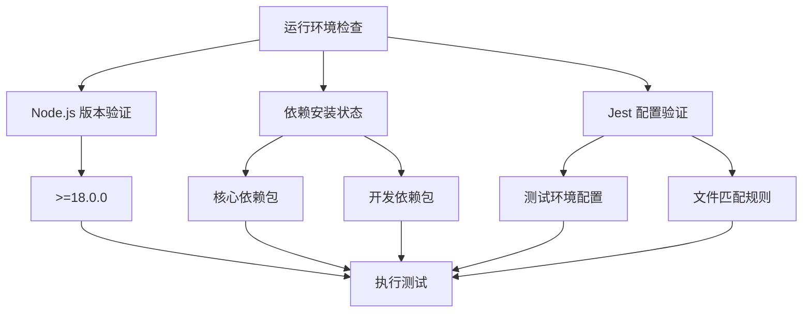
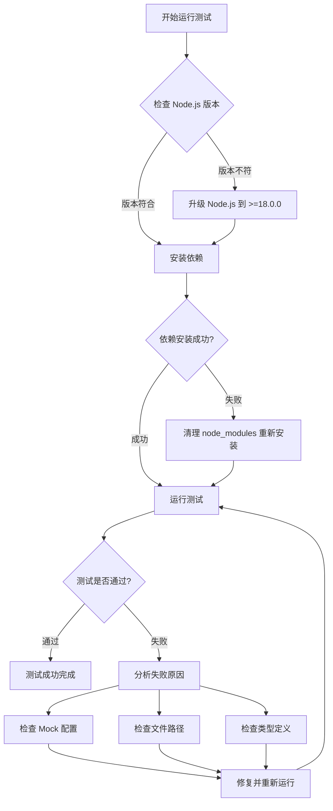

# 运行 file-handler.test.js 测试文件设计

## 概述

本设计文档旨在确保 `file-handler.test.js` 测试文件能够成功运行，并通过所有测试用例。该测试文件是 Docusaurus 插件项目中的核心文件处理组件测试，涵盖文件依赖分析、递归依赖收集、缓存处理和错误容错等关键功能。

## 项目背景

### 技术栈分析
- **框架**: Docusaurus 插件开发
- **测试框架**: Jest + jsdom 环境
- **语言**: TypeScript/JavaScript
- **核心功能**: 文件处理、依赖分析、递归依赖收集

### 项目结构
- **主要模块**: FileHandler 类负责文件处理和依赖分析
- **依赖组件**: PathResolver、DependencyAnalyzer、hash-utils
- **测试环境**: Node.js >=18.0.0 + Jest

## 测试文件分析

### 核心测试组件
测试文件主要验证 `FileHandler` 类的以下功能：

| 功能模块 | 测试范围 | 关键方法 |
|---------|---------|----------|
| 基础文件处理 | processDemo() | 单个文件处理、依赖解析 |
| 哈希计算 | calculateFileHash() | 文件内容哈希生成 |
| 文件检测 | fileExists() | 文件存在性验证 |
| 并行处理 | processDemosParallel() | 批量文件处理 |
| 递归依赖收集 | processDependenciesRecursive() | 多层依赖分析 |

### 测试用例覆盖

#### 1. 基础功能测试
- 正确处理单个演示文件
- 处理没有扩展名的文件
- 依赖文件读取失败的容错处理

#### 2. 递归依赖收集测试
- 多层依赖结构处理
- 循环依赖检测与处理
- 深度限制控制
- 错误容错处理

#### 3. 并行处理测试
- 批量文件并行处理
- 部分文件处理失败的容错
- 空文件列表处理

## 运行环境要求

### 系统要求
- **Node.js**: >=18.0.0 (当前项目要求)
- **包管理器**: pnpm (项目配置)
- **测试环境**: jsdom

### 依赖检查清单

## 测试执行策略

### 预执行检查
1. **环境验证**
   - 验证 Node.js 版本是否满足 >=18.0.0
   - 检查项目依赖是否正确安装
   - 确认 Jest 配置正确

2. **文件依赖检查**
   - 确认所有被测试的源文件存在
   - 验证 mock 模块配置正确
   - 检查测试文件路径和导入语句

### 执行命令序列

| 步骤 | 命令 | 目的 |
|-----|------|------|
| 1 | `cd packages/docusaurus-lib-dev` | 切换到测试项目目录 |
| 2 | `npm install` 或 `pnpm install` | 安装项目依赖 |
| 3 | `npm test file-handler.test.js` | 运行特定测试文件 |

### 替代执行方案

如遇环境问题，可采用以下方案：

## 潜在问题分析

### 环境相关问题

#### Node.js 版本不兼容
- **现象**: 项目要求 Node.js >=18.0.0，但当前环境可能是 v12.22.12
- **解决方案**: 使用 nvm 切换到兼容版本或升级 Node.js

#### 依赖安装问题
- **现象**: 某些依赖包安装失败或版本冲突
- **解决方案**: 清理缓存，重新安装依赖包

### 测试代码相关问题

#### Mock 配置问题
- **现象**: Jest mock 配置不正确导致测试失败
- **关键 Mock 模块**:
  - `fs` 文件系统操作
  - `../utils/path-resolver` 路径解析
  - `../utils/dependency-analyzer` 依赖分析
  - `../utils/hash-utils` 哈希工具

#### 类型定义问题
- **现象**: TypeScript 类型定义缺失或不匹配
- **解决方案**: 确保所有类型接口正确导入

### 文件路径问题
- **现象**: 相对路径或绝对路径解析错误
- **解决方案**: 检查测试文件中的导入路径是否正确

## 错误容错机制

### 测试级别容错
- **部分测试失败**: 分析具体失败的测试用例，逐一排查
- **Mock 失效**: 重新配置相关 Mock 对象
- **异步操作**: 确保 Promise 和 async/await 正确处理

### 系统级别容错
- **内存不足**: 调整 Jest 配置，限制并发测试数量
- **文件权限**: 确保测试过程中有足够的文件系统访问权限

## 验证标准

### 测试通过标准
1. **所有测试用例通过**: 包括基础功能和递归依赖收集功能
2. **无错误输出**: Jest 运行过程中无未捕获的异常
3. **覆盖率满足**: 测试覆盖关键代码路径

### 性能标准
- **执行时间**: 测试应在合理时间内完成（通常 < 30秒）
- **内存使用**: 避免内存泄漏和过度内存使用

## 后续优化建议

### 测试稳定性
- 考虑添加更多边界条件测试
- 增强 Mock 数据的真实性
- 优化测试执行速度

### 持续集成
- 将测试集成到 CI/CD 流程
- 设置自动化测试触发条件
- 建立测试结果通知机制