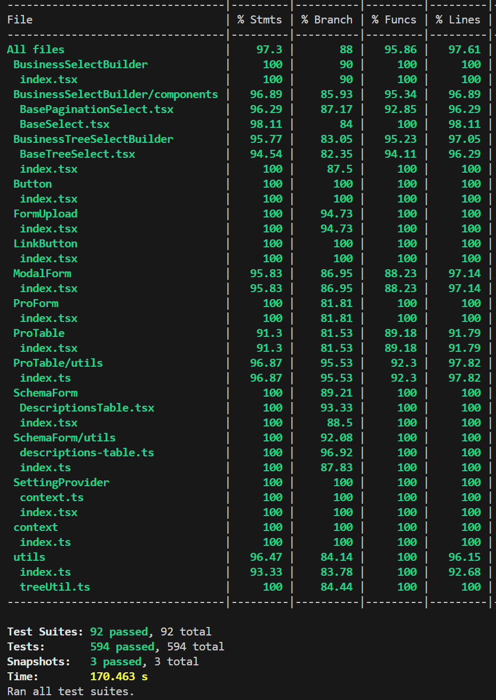

# react-admin-kit

[中文文档](./README.zh-CN.md)

<p>
  <a href="https://www.npmjs.com/package/react-admin-kit"></a>
   <a href="https://www.npmjs.com/package/react-admin-kit"></a>
  <a href="https://www.npmjs.com/package/react-admin-kit"></a>
</p>

<p align="left">
    
  <p style="font-size: 22px">A React component library for rapidly building forms and tables</p>
</p>

[Documentation (github pages)](https://jaykou25.github.io/react-admin-kit/)

Version v1.0 is officially released! Comprehensive test coverage with code coverage over 90% and branch coverage over 85%.

 

## Introduction

React Admin Kit (RAK) is a component library based on React and Ant Design, designed for rapidly building forms and tables in admin systems. Using RAK not only greatly improves development efficiency but also reduces maintenance costs for different developers due to its convention-based API. Additionally, since forms and tables are generated from configuration arrays, reusing forms and tables across different pages becomes very simple.

## Why This Component Library?

Or why do we need RAK when ProComponent already exists?

For admin business systems, ProComponent's components like `ProLayout` and `ProTable` have become a paradigm, greatly facilitating our frontend developers.

However, ProComponent still has some issues, or it doesn't quite achieve the same user experience as Antd. The reason, for me, is that it takes too much time to read the documentation and select the right components...

We want to focus on just two points: Table and Form, which are the most commonly used page structures in admin systems. We connect Table and Form with schema at the core, and derive other components from this.

If you're a ProComponent user, most APIs can be passed through to RAK. If you haven't used ProComponent before, you can start directly with RAK's examples and documentation, progressively using other APIs.

## How to Use

RAK depends on Antd, so you need to install Antd first.

```bash
npm install antd
```

Install RAK

```bash
npm install react-admin-kit
```
View [Component Documentation](https://jaykou25.github.io/react-admin-kit/components/schema-form) and get started ✨.

> If you want to use antd v4, please see the notes below 👇
>
> Using antd v4 requires importing the style file.
>
> ```js
> import 'antd/dist/antd.min.css';
> ```
>
> Since ProComponent introduces some components from antd v5, such as ColorPicker. If you use the vite bundler, you will encounter errors during local development. You can switch to the webpack bundler for development.
>
> Please use RAK < v0.4, v0.4 and later only support antd v5 or higher version.

### Generate Forms

Conventional forms are composed of Form.Item.

```js
import { Form, Input, DatePicker, Select } from 'antd';

<Form onFinish={handleFinish}>
  <Form.Item label="Customer Name" name="name">
    <Input />
  </Form.Item>

  <Form.Item label="Contract Date" name="contractDate">
    <DatePicker />
  </Form.Item>

  <Form.Item label="Payment Method" name="payType">
    <Select
      options={[
        { label: 'Alipay', value: '1' },
        { label: 'WeChat', value: '2' },
      ]}
    />
    ;
  </Form.Item>
</Form>;
```

RAK generates forms through schemas, where one schema corresponds to one Form.Item.

```js
import { SchemaForm } from 'react-admin-kit';

const columns = [
  {
    title: 'Customer Name',
    dataIndex: 'name',
  },
  {
    title: 'Contract Date',
    dataIndex: 'contractDate',
    valueType: 'date',
  },
  {
    title: 'Payment Method',
    dataIndex: 'payType',
    valueType: 'select',
    fieldProps: {
      options: [
        { label: 'Alipay', value: '1' },
        { label: 'WeChat', value: '2' },
      ],
    },
  },
];

// Please refer to each component's documentation
const Demo = () => {
  return <SchemaForm columns={columns} onFinish={handleFinish} />;
};
```

### Generate Tables

```js
import { ProTable } from 'react-admin-kit';

// Please refer to each component's documentation
const Demo = () => {
  return <ProTable columns={columns} />;
};
```

## Core Components Introduction

RAK has only 3 core components, and they are composable:

- `SchemaForm - JSON Form`: `SchemaForm`
- `ModalForm - Modal Form`: `Modal` + `SchemaForm`
- `ProTable - Advanced Table`: `ProTable` + `ModalForm`

So component properties can be passed through. For example, in the `ModalForm` component, you can pass through `SchemaForm` properties. In the `ProTable` component, you can pass through `Modal` and `SchemaForm` properties. See each component's documentation for details.

## Project Dependencies

```js
{
  "@ant-design/pro-form": "~2.25.0",
  "@ant-design/pro-table": "~3.15.0",
  "@ant-design/pro-utils": "~2.15.0",
}

// peerDependency
{
  "antd": ">=4.23.4",
}
```

Recommend using antd v5 or higher version.
