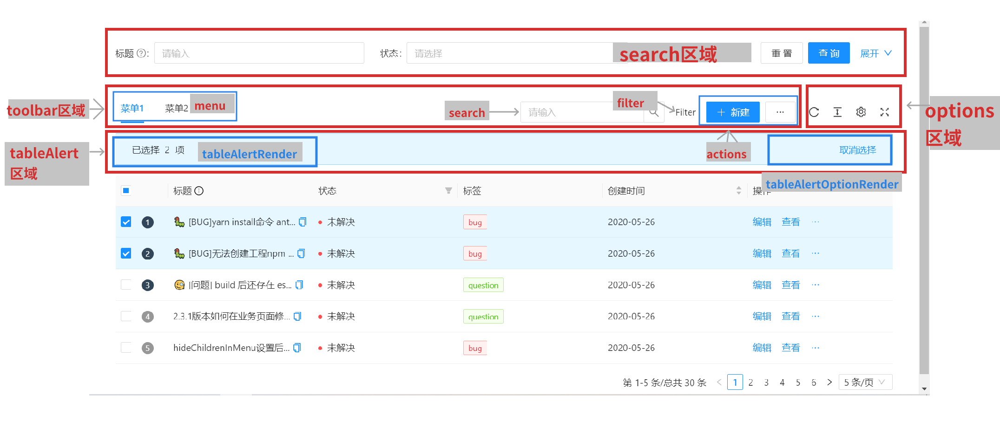

---
group:
  title: 组件
---

## ProTable - 高级表格

这个组件是对 [Antd ProTable](https://procomponents.ant.design/components/table) 的封装, 在它的基础上融入了弹窗表单, 删除, 前端导出等功能并且优化了一些功能. 使用得代码更加简洁, 使用上更加优雅.

下面的图列出了 ProTable 各区域的名称, 方便理解它的 api 

### 一个基本的 CRUD 表格

<code src="./basic/index.tsx"></code>

### 更改弹窗表单的布局

<code src="./modalFormLayout/index.tsx"></code>
