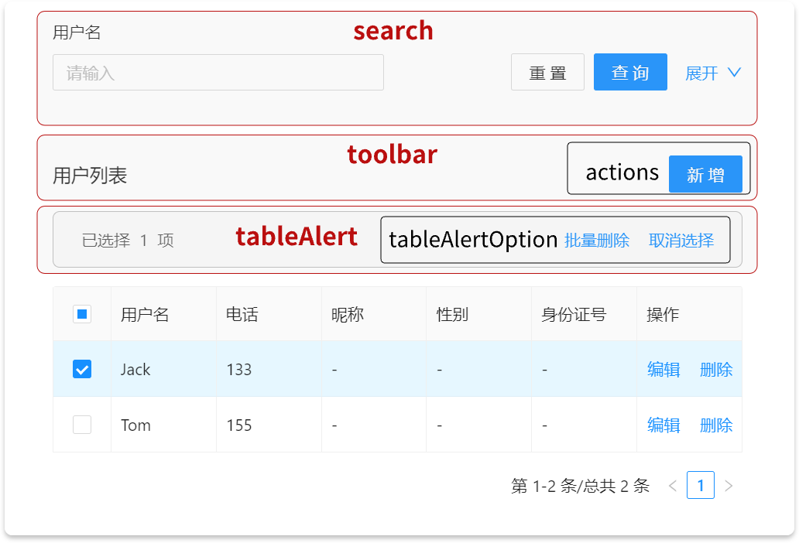

---
group:
  title: 核心组件
  order: 0
order: 2
toc: content
title: ProTable - 高级表格
description: ProTable 是 Antd Protable 和 ModalForm 的结合, 并且融入了删除, 前端导出等功能. 更加贴合实际场景.
---

# ProTable - 高级表格

ProTable 是 [Antd ProTable](https://procomponents.ant.design/components/table) 和 ModalForm 的结合, 并且融入了删除, 前端导出等功能. 更加贴合实际场景.

如果你之前并不熟悉 ProTable 的 api, 完全可以直接看例子来开始使用.

### 一个基本的 CRUD 表格

这是一个基本的 CRUD 表格, 包含了 **查询**, _新建_, _编辑_, _删除_. 初次接触 ProTable 的用户可能会遇到很多陌生的 api, 让人感觉很不舒服, 没关系, 我们会通过几个例子慢慢展开.

<code src="./demos/basic/index.tsx"></code>

### 查询

先来认识一下 `request` 属性, 通过传入一个请求函数, ProTable 就帮我们做好了数据请求, 分页请求, 查询请求, 重置请求等功能. 请求函数必须返回一个 promise (一般是一个 axios 实例), 并且 promise 中返回的数据需要满足下面的要求:

```js
// Promise回返的数据格式
{
  data: [], // 表格数据源
  success: true,
  total: 6 // 用于分页
}
```

```js
<ProTable
  request={(params) => requestApi(params)}
  ...
/>
```

请求函数的第一个参数 `params` 会包含分页, 搜索等请求参数:

```js
{
  current: 2,
  pageSize: 5,
  ... // 其它搜索字段
}
```

用户可以与后台约定好这些请求参数和返回格式, 也可以自已在全局包装一下后传给后台.

column 里的 `hideInSearch` 字段控制是否在搜索表单里隐藏.

```js {4}
{
  title: '昵称',
  dataIndex: 'nickName',
  hideInSearch: true, // 在搜索表单里隐藏
}
```

<code src="./demos/retrieve/index.tsx"></code>

### 新增

接上一个例子, 我们先来添加一个新增按钮.

ProTable 内部规划了多个区域用于放置不同的按钮, 用户只要在相应的 api 上配置按钮就可以了. 这么做一方面能让各表格的功能区域保持清晰统一, 另一方面对于终端用户来说也能减少他们对表格操作的熟悉成本.



上图中的红色字是大区块, 大区块里还包含黑色的小区块. 对于新增按钮来说, 应该加到 toolbar 大区块里的 actions 小区块里.

```js {2,3}
<ProTable
  toolbar={{
    actions: [
      <Button
        key={1}
        type="primary"
      >
        新增
      </Button>,
    ],
  }}
```

添加了按钮之后, 通过 `innerRef.current.openModal()` 就能打开表单.

```js {2,8}
<ProTable
  innerRef={innerRef}
  toolbar={{
    actions: [
      <Button
        key={1}
        type="primary"
        onClick={() => innerRef.current.openModal()}
      >
        新增
      </Button>,
    ],
  }}
```

最后设置 onFinish 属性就完成了表单的新增.

```js {21}
<ProTable
  columns={getColumns()}
  request={mockRequest}
  pagination={{ pageSize: 5 }}
  innerRef={innerRef}
  toolbar={{
    actions: [
      <Button
        key={1}
        type="primary"
        onClick={() => innerRef.current?.openModal()}
      >
        新增
      </Button>,
    ],
  }}
  onFinish={async (values, formType) => {
    if (formType === 'new') {
      await mockAdd(values);
      message.success('新建成功!');
      actionRef.current?.reload(); // 新增成功后用 actionRef 重新请求接口
    }
  }}
/>
```

<code src="./demos/create/index.tsx"></code>

### 编辑

接上一个例子, 要实现编辑功能, 可以在 columns 里增加一个操作列来添加编辑按钮.

```js {5,8}
// columns
{
  title: '操作',
  valueType: 'option', // valueType 设为 option 代表是操作列
  render: (text, record, index, actionRef, innerRef) => [
    <LinkButton
      key={1}
      onClick={() => innerRef.current?.openModal('edit', record)}
    >
      编辑
    </LinkButton>,
  ],
},
```

当 valueType 为 option 时, render 函数会被自动注入 innerRef 参数, 通过 innerRef 就可以打开编辑弹框并且对表单赋值.

编辑弹框打开后我们继续完善 onFinish 中的更新部分:

```js {11}
<ProTable
  ...
  onFinish={async (values, formType, formData) => {
    if (formType === 'new') {
      await mockAdd(values);
      message.success('新建成功!');
      actionRef.current?.reload();
    }

    if (formType === 'edit') {
      await mockUpdate({ ...values, id: formData.id });
      message.success('更新成功!');
      actionRef.current?.reload();
    }
  }}
/>
```

从 11 行我们注意到, 更新接口除了需要表单值以外, 还需要额外传递记录 id 给后台.

onFinish 的第一个参数 values 是表单收集的值, 里面并没有 id. 这个时候就可以从 onFinish 的第三个参数 formData 里来取值. formData 就是上一步打开编辑弹框时赋给表单的初始值, 也就是 `innerRef.current?.openModal('edit', record)` 里的 record.

<code src="./demos/update/index.tsx"></code>

### 删除

删除功能与上文中的 `request` 属性非常相似, ProTable 提供了一个 `delFunction` 属性, 只需要传入一个删除函数, ProTable 就帮我们做好了多选删除和行上删除的功能,

删除函数同样返回一个 promise, 参数是所选行的 id 数组.

另外要支持多选删除还需要开启行选择功能.

```js
<ProTable
  ...
  delFunction={mockDetroy}
  rowSelection={{}}
/>
```

行上删除的功能默认是关闭的, 是为了节省列的横向空间, 可以在 columns 里单独开启.

```js {13-19}
// columns
{
  title: '操作',
  valueType: 'option', // valueType 设为 option 代表是操作列
  render: (text, record, index, actionRef, innerRef) => [
    <LinkButton
      key={1}
      onClick={() => innerRef.current?.openModal('edit', record)}
    >
      编辑
    </LinkButton>,
  ],
  // boolean或函数
  enableDelete: true,
  enableDelete: () => ({
    disabled: true,
    visible: true,
    danger: true
  }),
},
```

<code src="./demos/destroy/index.tsx"></code>

### valueType

ProTable 同样支持 valueType, 只是与 SchemaForm 不同的是, ProTable 的 valueType 主要是用于显示. 比如当指定 `date` 类型时, 当后台返回一个时间戳时, 表格中会自动显示成时间.

<code src="./demos/valueType/index.tsx"></code>

### renderText 与 render 的区别

在 ProTable 的 column 里`render`跟`renderText`很容易混淆.

`renderText`更接近于 Antd Table 的 render, 但是必需返回 string. 最终在表格上显示的时候会把省略号, 复制图标等内容拼接上去.

`render`可以完全自定义内容的显示. 但是它的第一个参数是`dom`而不是`text`, 这个需要注意. 这个 dom 里包含了省略号和复制图标等内容.

<code src="./demos/renderText/index.tsx"></code>

### 更改弹窗表单的布局

`formProps`属性可以透传 SchemaForm 中的属性.

<code src="./demos/modalFormLayout/index.tsx"></code>

### 弹窗只读模式

`innerRef.current?.openModal('read', initialData)`

<code src="./demos/readonly/index.tsx"></code>

### 打开弹窗后请求数据回显

可以用 formType 判断只有当编辑时才请求

<code src="./demos/onOpen/index.tsx"></code>

### onFinish

onFinish 回调有三个参数, 第一个参数是表单里收集到的值, 第二个参数是表单类型, 第三个参数是打开弹窗时赋给表单的初始值(这里可以携带一些额外数据比如 id 等).

<code src="./demos/onFinish/index.tsx"></code>

### 受控表单

也可以不使用 request, 当成普通 table 来使用. 同样集成了新增编辑功能.

<code src="./demos/controlled/index.tsx"></code>

### 开启前端导出列表

ProTable 内置了导出功能, 默认是关闭, 可通过 `tableAlertOption` 属性开启.

column 里增加了 `renderExport` 自定义导出的内容

<code src="./demos/export/index.tsx"></code>

### ⭐ 数据处理和收集 - 约定式

与[SchemaForm 一样](/components/schema-form#-数据处理和收集---约定式), ProTable 同样支持约定式数据处理.

<code src="./demos/convention/index.tsx"></code>

### API

### ProTable

| 参数             | 说明                                                                                                                       | 类型                                                                                | 默认值                                       |
| ---------------- | -------------------------------------------------------------------------------------------------------------------------- | ----------------------------------------------------------------------------------- | -------------------------------------------- |
| request          | 获取 `dataSource` 的方法                                                                                                   | `(params?: { pageSize,current }, sort, filter) => Promise<{ data, success, total}>` | `--`                                         |
| actionRef        | 用于手动触发 table 的 reload 等操作                                                                                        | `MutableRefObject<ActionType>`                                                      | `--`                                         |
| innerRef         | 用于控制弹窗的打开; 获取 dataSource, 总页数等信息                                                                          | `MutableRefObject<InnerRefType>`                                                    | `--`                                         |
| delFunction      | 用于多选删除和行上删除的方法                                                                                               | `(ids) => Promise<void>`                                                            | `--`                                         |
| name             | name 被用于显示在表格标题上, 弹窗的标题上, 以及导出的文件名上. 也可不传. 若要关闭表格标题的显示, 可以用 headerTitle: false | `string`                                                                            | `--`                                         |
| noPadding        | 是否去掉 table 外的的 padding, 一般用于纯表格场景时                                                                        | `boolean`                                                                           | `false`                                      |
| onFinish         | 点击弹窗确认按钮后的回调                                                                                                   | `(values, formType, formData) => Promise<any> \| void`                              | `--`                                         |
| onOpen           | 打开弹窗后的回调                                                                                                           | `(formType, formRef, formData) => Promise \| void`                                  | `--`                                         |
| tableAlertOption | tableAlertOption 区域的选项, 这里面集成了删除, 导出等功能                                                                  | [TableAlertOption](/components/pro-table#tablealertoption)                          | `{ hideDelete: false, enableExport: false }` |
| modalProps       | 传给 Modal 的属性                                                                                                          | [ModalProps](https://4x.ant.design/components/modal-cn/#API)                        | `--`                                         |
| formProps        | 传给 SchemaForm 的属性                                                                                                     | [SchemaFormProps](/components/schema-form#api)                                      | `--`                                         |

### InnerRef

| 参数       | 说明                                                                                                                        | 类型                                                           | 默认值 |
| ---------- | --------------------------------------------------------------------------------------------------------------------------- | -------------------------------------------------------------- | ------ |
| openModal  | 用于打开弹窗; formType 可用于在 onFinish 的时候判断表单类型; `innerRef.current?.openModal('edit', {name: 'jack', age: 18})` | `(formType: 'new' \| 'edit' \| 'read', initialValues) => void` | `--`   |
| setData    | 用于存储额外信息.                                                                                                           | `(vals: Record<string, any>) => void`                          | `--`   |
| data       | 获取存储的额外信息.                                                                                                         | `Record<string, any>`                                          | `--`   |
| dataSource | 获取 request 请求到的 dataSource                                                                                            | `any[]`                                                        | `--`   |
| total      | 获取 request 请求到的数据总数                                                                                               | `number`                                                       | `--`   |
| params     | 获取 request 的请求参数                                                                                                     | `Record<string, any>`                                          | `--`   |

### TableAlertOption

| 名称         | 说明                 | 类型               | 默认                                     |
| ------------ | -------------------- | ------------------ | ---------------------------------------- |
| hideDelete   | 是否隐藏勾选删除功能 | `boolean`          | `false`                                  |
| enableExport | 是否开启导出功能     | `boolean`          | `false`                                  |
| exportName   | 导出文件的名字       | `string`           | 默认以 ProTable 的 name 属性为导出文件名 |
| actions      | 定义该区域额外的按钮 | `Array[ReactNode]` | -                                        |

### Schema

更多请查看[文档](https://procomponents.ant.design/components/table#columns-%E5%88%97%E5%AE%9A%E4%B9%89)

只列举在 Table 模式下特有的. Form 模式的请参考[SchemaForm](/core-components/schema-form#表单场景的-schema)

| 参数         | 说明                                                                                            | 类型                                                                                         |
| ------------ | ----------------------------------------------------------------------------------------------- | -------------------------------------------------------------------------------------------- |
| dataIndex    | 表格内的取值字段                                                                                | `string`                                                                                     |
| valueType    | 数据的渲渲染方式，比如指定 date 就会自动时间处理                                                | `ProFieldValueType`                                                                          |
| title        | 标题的内容                                                                                      | `ReactNode` \| `(props,type,dom)=> ReactNode`                                                |
| ellipsis     | 是否自动缩略                                                                                    | `boolean`                                                                                    |
| copyable     | 是否支持复制                                                                                    | `boolean`                                                                                    |
| valueEnum    | 支持 object 和 Map，Map 是支持其他基础类型作为 key                                              | `(Entity)=> ValueEnum` \| `ValueEnum`                                                        |
| renderExport | 定义前端导出的内容                                                                              | `(text, record, index) => string`                                                            |
| renderText   | 用于自定义表格上的文字显示; renderText 会保留省略号, 图标等                                     | `(text, record) => string`                                                                   |
| render       | 用于完全自定义表格上的显示; 它的第一个参数是一个 ReactNode, 它里面包含了省略号, 复制图标等内容. | `(dom, record, index) => any`                                                                |
| hideInForm   | 在 Form 中隐藏                                                                                  | `boolean`                                                                                    |
| hideInTable  | 在 Table 中隐藏                                                                                 | `boolean`                                                                                    |
| hideInSearch | 在 Search 中隐藏                                                                                | `boolean`                                                                                    |
| enableDelete | 用于开启行上删除功能                                                                            | `boolean` \| `(record, index) => {disabled?: boolean; visible?: boolean; danger?: boolean }` |
